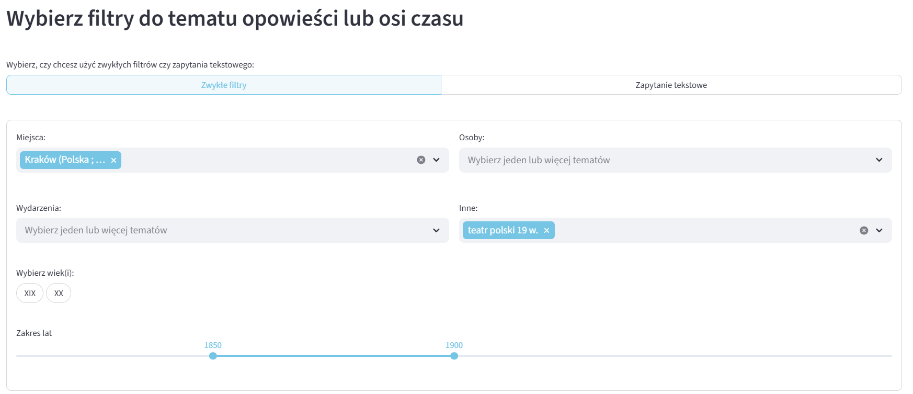
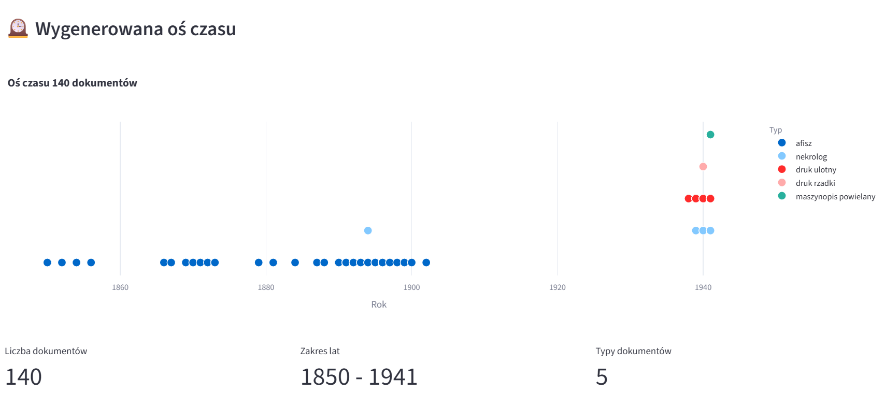
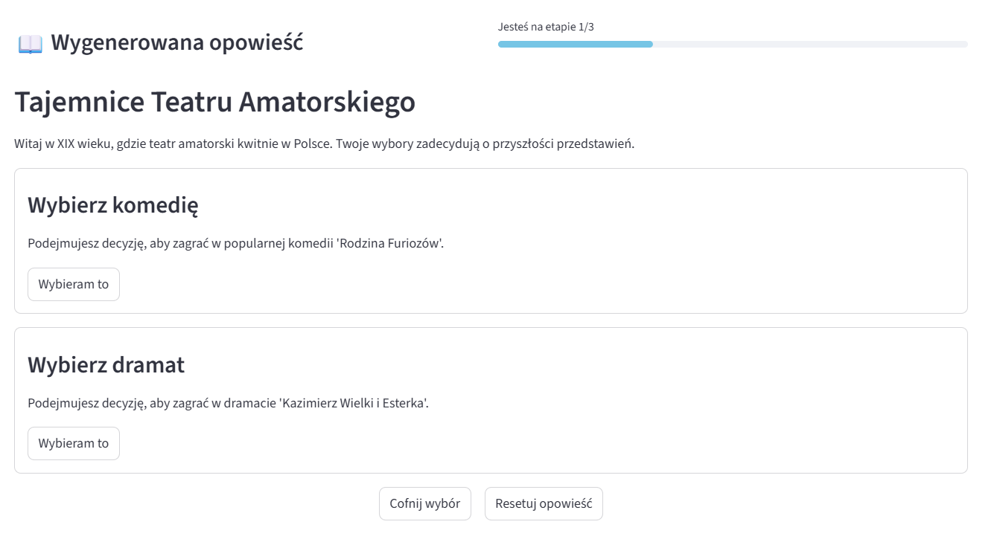

# JBC Interactive Storytelling

## Spis treści

- [Opis projektu](#opis-projektu)
- [Użyte technologie](#użyte-technologie)
- [Struktura projektu](#struktura-projektu)
- [Zrzuty ekranu aplikacji](#zrzuty-ekranu-aplikacji)
- [Uruchomienie aplikacji lokalnie](#uruchomienie-aplikacji-lokalnie)

## Opis projektu

Projekt integruje metadane dokumentów życia społecznego JBC (Jagiellońska Biblioteka Cyfrowa) w graf wiedzy, tworzy powiązania semantyczne i wykorzystuje LLM do generowania narracji tematycznych lub chronologicznych. Interfejs umożliwia eksplorację kolekcji w formie osi czasu lub ciągłych opowieści, wspierając kontekstowe odkrywanie treści w badaniach historycznych i edukacyjnych. Do generowania opwieści i przetwarzania zapytań tekstowych używany jest model GPT-4o mini od OpenAI.

Dane obecnie są używane z następującego źródła: [Jagiellońska Biblioteka Cyfrowa - wybrane dokumenty](https://jbc.bj.uj.edu.pl/dlibra/results?q=&action=SimpleSearchAction&type=-6&p=0&qf1=collections%3A188&qf2=Subject%3AKrak%C3%B3w%20%28Polska%20%3B%20region%29&qf3=Subject%3AII%20wojna%20%C5%9Bwiatowa%20%281939-1945%29&qf4=Subject%3Adruki%20ulotne%20z%20lat%201939-1945&qf5=Subject%3Adruki%20ulotne%2021%20w.&qf6=Subject%3Ateatr%20polski%2019%20w.&qf7=Subject%3Ateatr%2019%C2%A0w.&qf8=Subject%3ATeatr%20Polski%20%28Krak%C3%B3w%29&qf9=Subject%3ADrukarnia%20%E2%80%9ECzasu%E2%80%9D%20%28Krak%C3%B3w%29&qf10=Subject%3ATowarzystwo%20Artyst%C3%B3w%20Dramatycznych&qf11=Subject%3AMa%C5%82opolska%20%28Polska%20%3B%20wojew%C3%B3dztwo%29&qf12=Subject%3ATeatr%20%C5%81%C3%B3dzki%20%28Polska%29&qf13=Subject%3Aliteratura&qf14=Subject%3Aafisz%20muzyczny&ipp=50)

## Dostęp do aplikacji

Aplikacja jest dostępna pod adresem: [https://jbc-interactive-storytelling.streamlit.app/](https://jbc-interactive-storytelling.streamlit.app/).

## Użyte technologie

- Python
- Streamlit
- Gemini API (google-genai)
- OpenAI API (gpt-4o mini)
- Streamlit Community Cloud

## Struktura projektu

- `main.py` - główny plik aplikacji Streamlit.
- `utils.py` - plik z funkcjami pomocniczymi do przetwarzania danych, generowania grafu wiedzy i interfejsu użytkownika, a także wszystkich funkcjonalności.
- `models.py` - plik z klasami reprezentującymi strukturę dokumentów oraz grafu wiedzy i operacje na nim.
- `requirements.txt` - plik z listą wymaganych bibliotek Python.
- `data/` - folder zawierający pliki danych (np. plik RIS z metadanymi JBC).
- `.streamlit/config.toml` - plik dostosowujący styl aplikacji Streamlit.
- `jupyter_notebooks/` - folder z notatnikami Jupyter używanymi do eksperymentów i analizy danych przed implementacją aplikacji.
- `locales/` - folder z plikami JSON zawierającymi teksty interfejsu w różnych językach (np. `en.json`, `pl.json`), a także pogrupowane filtry tematyczne.
- `evaluation_module.py` - moduł do oceny jakości generowanych narracji i osi czasu, ankieta do wypełniania przez użytkowników.

## Zrzuty ekranu aplikacji

Interfejs aplikacji z wybranymi filtrami:

Przykładowa oś czasu wygenerowana przez aplikację:

Przykładowa interaktywna narracja wygenerowana przez aplikację:

## Uruchomienie aplikacji lokalnie

1. Zainstaluj wymagane biblioteki.
   - Upewnij się, że masz odpowiednią wersję Pythona: 3.9 lub nowszy `python --version`
   - Stwórz wirtualne środowisko: `python -m venv venv`
   - Aktywuj to wirtualne środowisko: `source venv/scripts/activate`
   - Zainstaluj wymagane biblioteki: `pip install -r requirements.txt`

2. Pobierz własny klucz do Gemini API.
   - Utwórz klucz tutaj: [link](https://aistudio.google.com/app/apikey)
   - Zapisz ten klucz jako zmienną środowiskową: [instrukcja](https://ai.google.dev/gemini-api/docs/api-key?hl=pl#set-api-env-var)

3. Uruchom ponownie terminal i/lub IDE. Upewnij się, że masz aktywne wirtualne środowisko (`source venv/scripts/activate`).

4. Uruchom aplikację komendą `streamlit run main.py`. Otworzy się ona w przeglądarce pod adresem `http://localhost:8501/`. _Uwaga: Pierwsze uruchomienie może potrwać kilka minut, ponieważ aplikacja będzie pobierać i przetwarzać dane z Jagiellońskiej Biblioteki Cyfrowej._

5. Aby pobrać więcej danych (albo dane z innej kategorii) z Jagiellońskiej Biblioteki Cyfrowej:
   - Wejdź na stronę: [jbc.bj.uj.edu.pl](https://jbc.bj.uj.edu.pl/dlibra/results).
   - Wybierz odpowiednie filtry.
   - Na koniec linka strony wklej `&ipp=50`, gdzie zamiast `50` wpisz liczbę dokumentów, które chcesz pobrać.
   - Po załadowaniu wyników na stronie kliknij w prawym górnym rogu (pod paskiem wyszukiwania) `Dodaj wszystkie obiekty z listy do bibliografii`.
   - Pobrany plik umieść w folderze `/data` jako `dlibra.ris`.
   - Usuń folder `/data/rdfs`.
   - Uruchom aplikację komendą `streamlit run main.py`. Dla dużej liczby dokumentów pobranie i przetworzenie ich może długo zająć.

6. W przyszłośći (jeśli wymagane biblioteki są już zainstalowane, a klucz API jest ustawiony) wystarczy wykonać:
   - `source venv/scripts/activate`
   - `streamlit run main.py`